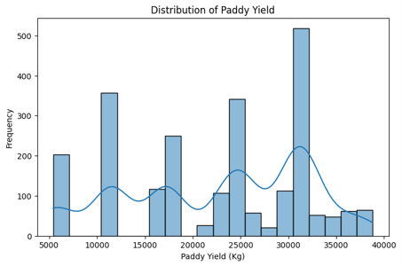
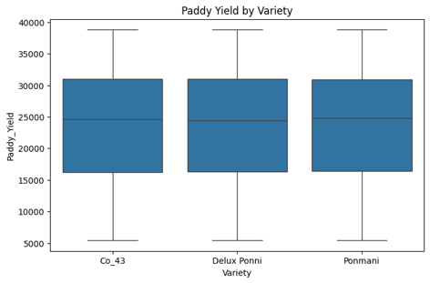
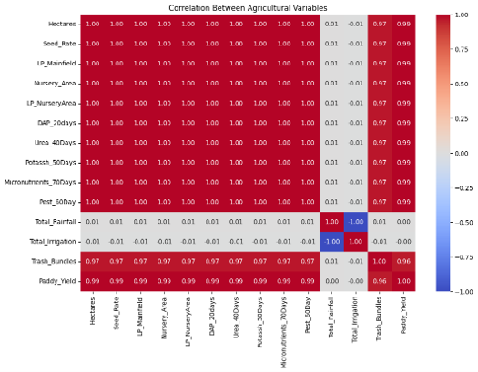
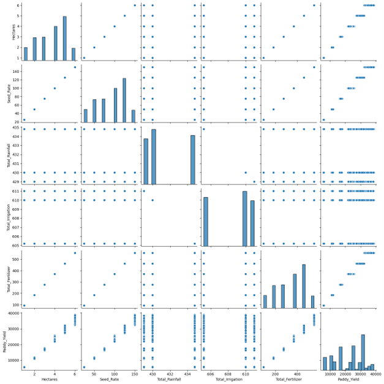

# 🌾 Paddy Crop Analysis Using Python

### Data Analysis | EDA | Visualization | Python

---

# 📖 Project Overview

The **Paddy Crop Analysis Using Python** project analyses a paddy cultivation dataset to identify factors affecting crop yield. The project covers data cleaning, preprocessing, exploratory data analysis (EDA), statistical analysis, visualization, and insights using Python.

---

# 📂 Dataset Information

| Item | Details |
|------|---------|
| Dataset | Paddy Dataset |
| Source | UCI Machine Learning Repository Paddy Dataset (https://archive.ics.uci.edu/dataset/1186/paddy+dataset) | 
| Records | 2,789 |
| Attributes | 45 |
| File Type | CSV |

---

# 🎯 Objectives

- Understand the dataset
- Clean and preprocess the data
- Perform Exploratory Data Analysis
- Identify factors affecting yield
- Create meaningful visualizations
- Generate insights for better agricultural decisions

---

# 🛠 Technologies Used

| Tool | Purpose |
|------|---------|
| Python | Programming |
| Pandas | Data Manipulation |
| NumPy | Numerical Computing |
| Matplotlib | Visualization |
| Seaborn | Statistical Visualization |
| Google Colab | Development |

---

# 📋 Data Preprocessing

✅ Checked data types

✅ Missing value treatment

✅ Duplicate removal

✅ Data cleaning

✅ Feature engineering

---

# 📊 Exploratory Data Analysis

### Univariate Analysis

- Histogram
- Count Plot
- Distribution Analysis

### Bivariate Analysis

- Box Plot
- Scatter Plot
- Soil Type vs Yield
- Variety vs Yield

### Multivariate Analysis

- Pair Plot
- Heatmap
- Correlation Matrix
- Grouped Bar Chart

---

# 📈 Statistical Analysis

- Mean
- Median
- Mode
- Standard Deviation
- Variance
- Min & Max

---

# 📸 Visualizations

## Histogram

---

## Box Plot

---

## Heatmap

---

## Pair Plot

---

# 📌 Key Findings

- Yield differs across paddy varieties.
- Soil type significantly affects productivity.
- Rainfall influences crop yield.
- Fertilizer application impacts production.
- EDA helped identify patterns and outliers.

---

# 🚀 Future Enhancements

- Machine Learning prediction model
- Power BI Dashboard
- Real-time weather integration
- Automated reporting
- More regional datasets

---

# ✅ Conclusion

This project demonstrates end-to-end data analysis using Python, providing meaningful insights into paddy cultivation and helping support agricultural decision-making.

---
