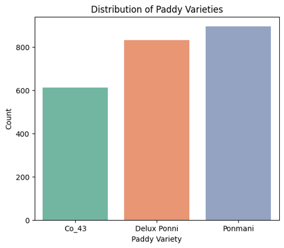
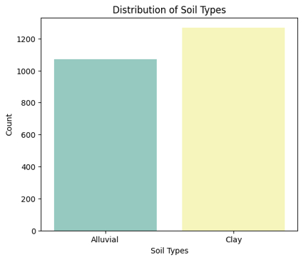
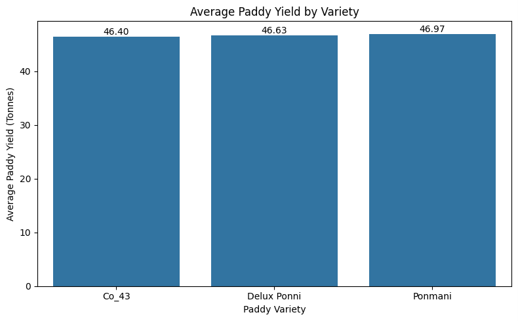
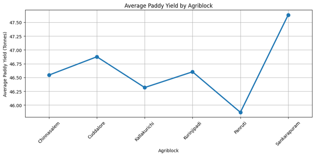
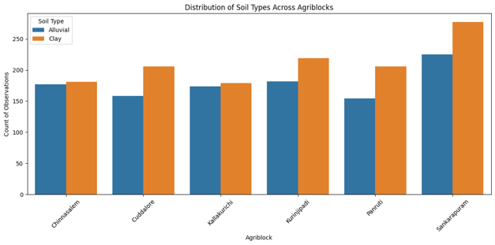
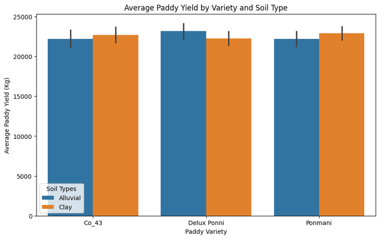
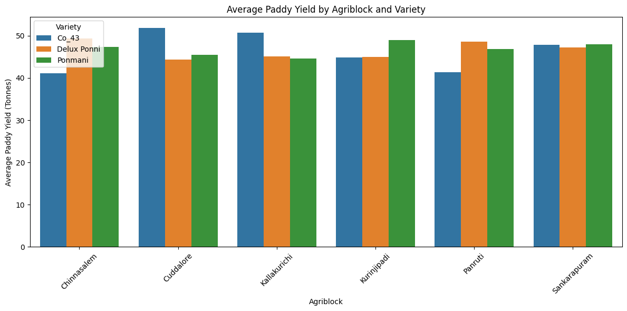
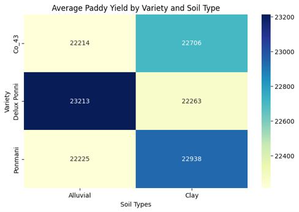

# 🌾 Paddy Crop Analysis Using Python

### Data Analysis | EDA | Visualization | Python

---

# 📖 Project Overview

The **Paddy Crop Analysis Using Python** project analyses a paddy cultivation dataset to identify factors affecting crop yield. The project covers data cleaning, preprocessing, exploratory data analysis (EDA), statistical analysis, visualization, and insights using Python.

---

# 📂 Dataset Information

| Item | Details |
|------|---------|
| Dataset | Paddy Dataset |
| Source | UCI Machine Learning Repository Paddy Dataset (https://archive.ics.uci.edu/dataset/1186/paddy+dataset) | 
| Records | 2,789 |
| Attributes | 45 |
| File Type | CSV |

---

# 🎯 Objectives

- To consolidate and preprocess the Paddy Crop dataset by integrating key agricultural attributes such as **paddy variety, soil type, seed rate, fertilizer application, irrigation practices, and crop yield** for effective analysis.

- To analyze the distribution and characteristics of major cultivation factors, including **paddy varieties, soil types, land area, and farming practices**, to understand overall dataset patterns.

- To compare paddy yield variations across different **paddy varieties and soil types** to identify factors associated with higher and lower agricultural productivity.

- To examine the relationship between cultivation factors such as **Agriblock, paddy variety, soil type, nursery practices, and crop yield** using statistical analysis and data visualization techniques.

---

# 🛠 Technologies Used

| Tool | Purpose |
|------|---------|
| Python | Programming |
| Pandas | Data Manipulation |
| NumPy | Numerical Computing |
| Matplotlib | Visualization |
| Seaborn | Statistical Visualization |
| Google Colab | Development |

---

# 📋 Data Preprocessing

✅ Checked data types

✅ Missing value treatment

✅ Duplicate removal

✅ Data cleaning

✅ Feature engineering

---

# 📊 Exploratory Data Analysis

### Univariate Analysis

- Histogram
- Count Plot
- Distribution Analysis

### Bivariate Analysis

- Bar Plot
- Line Plot
- Count Plot with Hue

### Multivariate Analysis

- Grouped Bar Chart
- Grouped Bar Plot
- Pivot Table Heatmap
- Correlation Matrix

---

# 📈 Statistical Analysis

- Mean
- Median
- Mode
- Standard Deviation
- Variance
- Min & Max

---

# 📸 Visualizations

## Histogram

---
## Count Plot

---

## Bar Plot

---

## Line Plot

---
## Count Plot with Hue

---
## Grouped Bar Chart

---

## Grouped Bar Plot

___

## Pivot Table Heatmap

___

## Heatmap

---

# 🔍 Key Findings

- The analysis of the Paddy Crop dataset revealed that agricultural factors such as **land area, seed rate, fertilizer application, nursery practices, and crop management activities** have a significant influence on paddy yield.

- The dataset showed variations in productivity across different **paddy varieties and soil types**, indicating that crop selection and soil conditions play an important role in achieving higher yields.

- Statistical analysis and visualization results identified strong relationships between cultivation practices such as **DAP, Urea, Potash, Micronutrients, Pest Control, and LP_Mainfield** and paddy yield, suggesting that effective resource management improves productivity.

- Different **Agriblocks and farming practices** showed variations in yield performance, highlighting the impact of regional cultivation patterns and agricultural methods.

- Correlation analysis indicated that most agricultural inputs have a **positive association with paddy yield**, while some environmental factors showed weaker relationships.

- Data exploration helped identify important factors affecting crop production and provided insights to support **better crop planning, resource optimization, and productivity improvement in paddy farming**.

---

# 🚀 Future Enhancements

- Machine Learning prediction model
- Power BI Dashboard
- Real-time weather integration
- Automated reporting
- More regional datasets

---

# ✅ Conclusion

The Paddy Crop Analysis showed that paddy yield varies based on **paddy variety, soil type, and Agriblock (location) conditions**.

- The analysis of different paddy varieties (**Delux Ponni, Ponmani, and CO-43**) showed variations in productivity under different cultivation conditions.
- Agriblock-wise analysis identified differences in production due to variations in **farming practices, resource utilization, and cultivation methods**.
- Selecting suitable paddy varieties, maintaining proper soil conditions, and optimizing cultivation practices are essential for achieving **higher paddy yield and improved agricultural productivity**.

---
